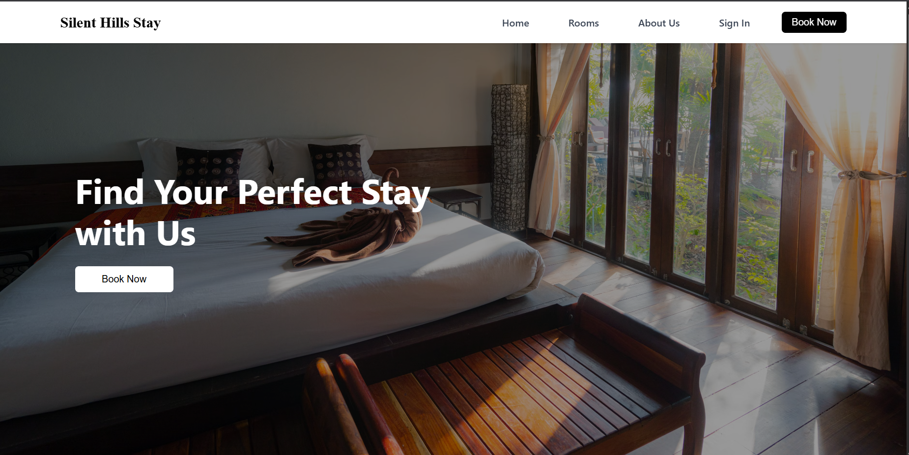
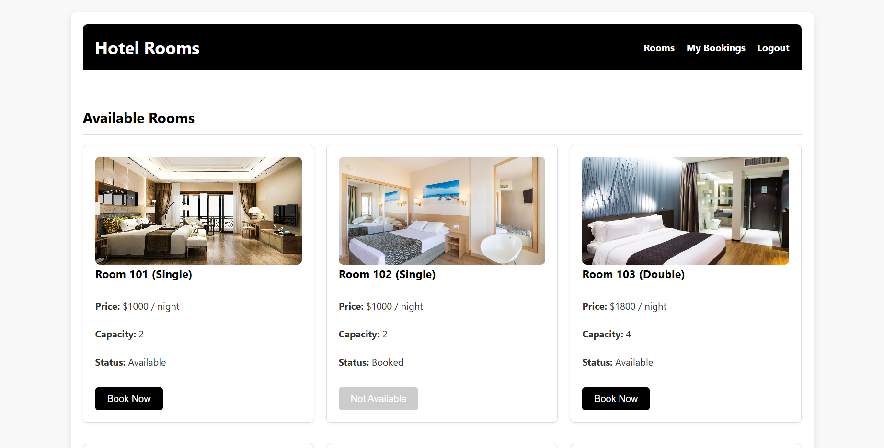
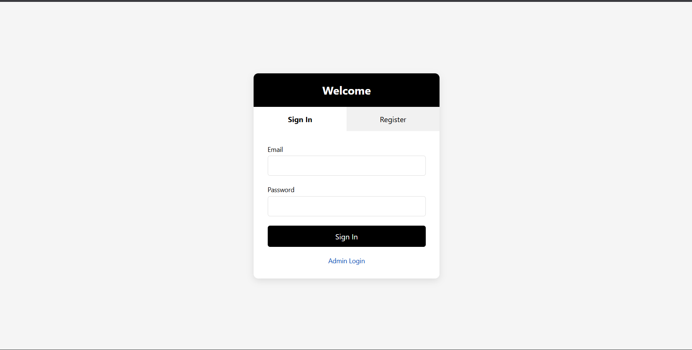
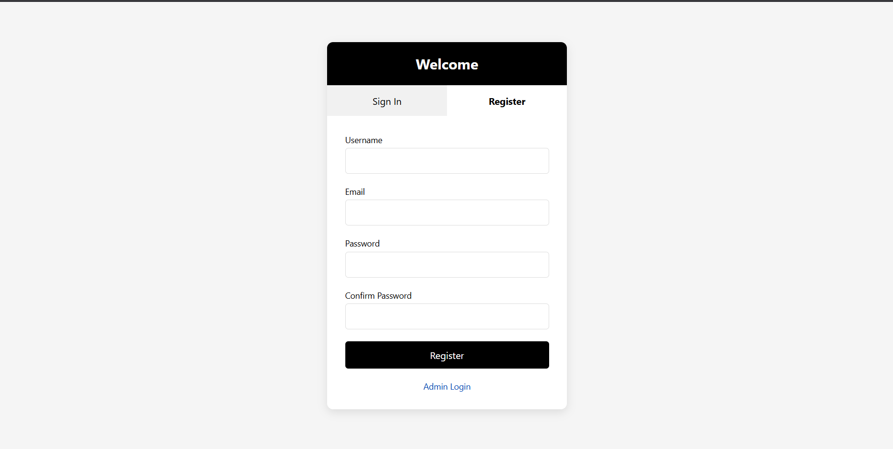
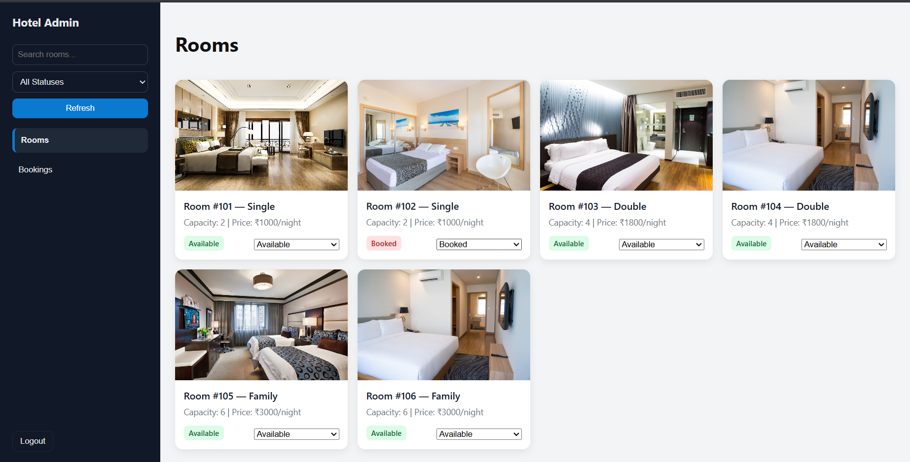
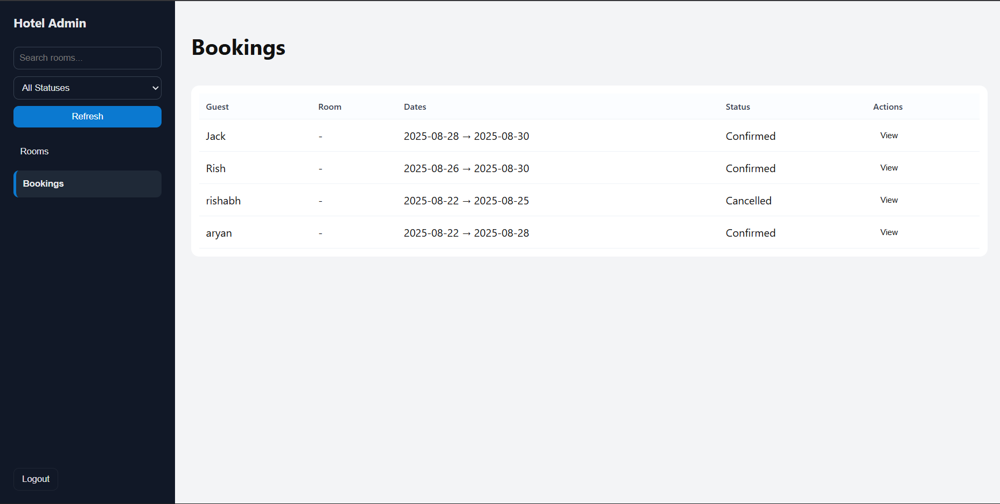

# 🏨 Hotel Booking & Management System  

A full-stack hotel booking system with **user-facing pages** (home, rooms, booking, login/register) and an **admin dashboard** for managing rooms, bookings, and user authentication.  

---

## 🚀 Features  

### 🌐 User Side  
- 🔐 User authentication (Register / Login with JWT)  
- 🏠 Home page with navigation  
- 📋 Rooms listing with images, pricing, status, and booking option  
- 📅 Room availability and booking flow  
- 📱 Responsive UI (works on desktop & mobile)  

### 🛠️ Admin Side  
- 🔑 Admin authentication  
- 📊 Dashboard for managing rooms and bookings  
- 🖼️ Add/update rooms with images, prices, and availability  
- 📌 Inline room status updates (Available, Booked, Maintenance, Disabled)  
- 📑 View and manage user bookings  

---

## 🖥️ Tech Stack  

**Frontend**  
- HTML, CSS, JavaScript   

**Backend**  
- Node.js, Express.js  
- MongoDB (Mongoose ODM)  

**Authentication**  
- JWT (JSON Web Tokens)  
- LocalStorage for client-side session persistence  

---

## 📸 Screenshots  

### 🏠 Home Page  
  

### 📋 Rooms Page (User View)  
  

### 🔐 Login Page  
  
  

### 📊 Admin Dashboard – Rooms Management  
  

### 📖 Admin Dashboard – Booking Management  
  

---
